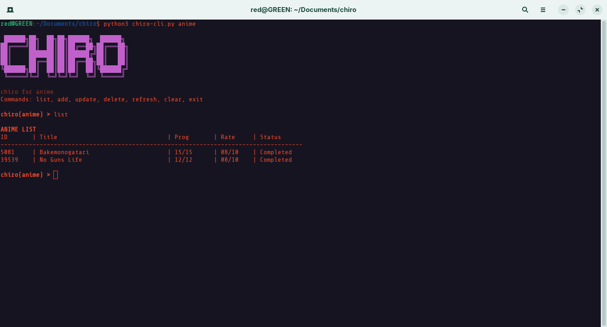

# chiro

A minimal terminal-based tracker for anime, manga, TV shows, and movies.

```
 ██████╗██╗  ██╗██╗██████╗  ██████╗
██╔════╝██║  ██║██║██╔══██╗██╔═══██╗
██║     ███████║██║██████╔╝██║   ██║
██║     ██╔══██║██║██╔══██╗██║   ██║
╚██████╗██║  ██║██║██║  ██║╚██████╔╝
 ╚═════╝╚═╝  ╚═╝╚═╝╚═╝  ╚═╝ ╚═════╝
```

---

## Screenshot


---

## Features

- Track **anime**, **manga**, **TV shows**, and **movies** in separate lists
- Auto-fetches metadata (title, total episodes/chapters) via [Jikan](https://jikan.moe/) and [TMDB](https://www.themoviedb.org/)
- Smart auto-status: `Planning → Watching/Reading` on first progress, `→ Completed` when total is reached
- Status priority system — higher statuses (`Watching`, `On-Hold`) are never auto-downgraded
- Per-session auto-save after every add, update, or delete
- `refresh` command to back-fill missing totals
- Arrow key navigation and command history (via `readline`)

---

## Requirements

- Python 3.7+
- `requests` library

```bash
pip install -r requirements.txt
```

---

## Setup

### 1. Clone the repo

```bash
git clone https://github.com/toriqul728/chiro-cli
cd chiro-cli
```

### 2. Install dependencies

```bash
pip install -r requirements.txt
```

### 3. (Optional) Make it executable

```bash
chmod +x chiro-cli.py
ln -s chiro-cli.py chiro
```

### 4. Set up your TMDB API key (for TV & Movies)

Get a free API key at [themoviedb.org → Settings → API](https://www.themoviedb.org/settings/api), then add it to `~/.chiro/config.json`:

```json
{
    "tmdb_key": "your_api_key_here"
}
```

This file is created automatically on first run. Anime and manga work without any API key.

---

## Usage

```bash
python3 chiro-cli.py <category>
```

Categories: `anime`, `manga`, `tv`, `movies`

### Commands

| Command  | Description                                      |
|----------|--------------------------------------------------|
| `list`   | Show all entries sorted alphabetically           |
| `add`    | Search and add a new entry                       |
| `update` | Update progress, status, or rating for an entry  |
| `delete` | Remove an entry                                  |
| `refresh`| Re-fetch totals for entries with unknown (`?`) counts |
| `clear`  | Clear the terminal                               |
| `exit`   | Save and quit                                    |

### Statuses

`Planning` → `Watching` / `Reading` → `On-Hold` → `Dropped` → `Completed`

Status is auto-managed based on progress but will never be downgraded automatically. The only forced override is `Completed` when progress hits the total.

---

## Data Storage

All data is stored locally in `~/.chiro/`:

```
~/.chiro/
├── config.json     # API keys
├── anime.json
├── manga.json
├── tv.json
└── movies.json
```

---

## Notes

- **TV totals** reflect the full series episode count across all seasons (sourced from TMDB). If you prefer to track season-by-season, update the total manually via the `update` command.
- Anime and manga data is sourced from [MyAnimeList](https://myanimelist.net/) via the Jikan API. Results are based on the closest title match.

---

## License

MIT
